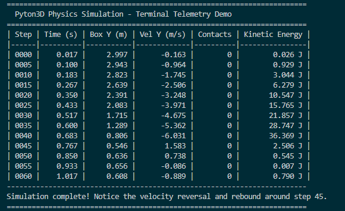
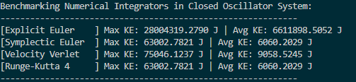
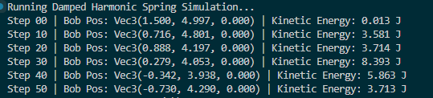
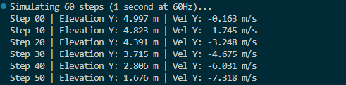

# Pyton3D

[](https://opensource.org/licenses/MIT)
[](https://www.python.org/downloads/)
[]()
[]()

Pyton3D is an open-source, 6-Degrees-of-Freedom (6-DOF) 3D rigid body physics simulation engine and interactive CAD workbench, **built completely from scratch in pure Python**.

It requires zero third-party physics libraries or native wrappers (no PyBullet, Box2D, ODE, or PhysX). Every mathematical and physical component—from vector algebra and quaternion kinematics to 15-axis Separating Axis Theorem (SAT) collision detection, iterative impulse manifolds, Coulomb friction cones, and numerical integrators—is implemented from first principles.

Pyton3D operates seamlessly in two execution modes:
1. **Headless / Terminal Mode**: High-throughput physics stepping, numerical integration benchmarks, batch execution, and tabular telemetry logging for scientific research, robotics, and CI pipelines.
2. **Desktop CAD Studio Mode**: An interactive Tkinter and Matplotlib 3D visualization workbench featuring real-time scene inspection, visual property tuners, and scene serialization.

---

## Key Highlights

- **Built 100% From Scratch**: Zero binary physics dependencies. Requires only standard Python with NumPy and Matplotlib.
- **Full 6-DOF Dynamics**: State tracking of position, linear velocity, acceleration, orientation quaternions, angular velocity, and world-space inertia tensor transformations.
- **Multiple Numerical Integrators**: Symplectic Euler, Velocity Verlet, Runge-Kutta 4th Order (RK4), and Explicit Euler.
- **Narrow-Phase SAT Collision**: Robust 15-axis Separating Axis Theorem for Oriented Bounding Boxes (OBB), Sphere-vs-Sphere, Sphere-vs-Box, and Plane half-spaces.
- **Iterative Impulse & Friction Solver**: Dual-axis orthogonal Coulomb dry friction ($|j_t| \le \mu j_n$), restitution recovery, and Baumgarte positional stabilization.
- **Constraints and Force Fields**: Damped Hooke\'s law springs, inelastic distance joints, aerodynamic drag, and Archimedes fluid buoyancy.
- **Headless Terminal Telemetry**: Built-in ASCII performance reporting, energy tracking, and contact manifold logging.
- **Interactive CAD Desktop Studio**: Real-time 3D camera controls (orbit, pan, zoom), live property inspector, object spawner, and environmental force tuners.

---

## Terminal Telemetry and Simulation Showcases

Pyton3D provides detailed headless simulation telemetry directly inside the terminal without requiring graphical display servers.

### 1. Free Fall, Impact, and Rebound Telemetry
Demonstration of a dynamic wooden box dropped from 3.0 meters onto a concrete half-space. The iterative impulse solver resolves penetration at step 45, executing restitution rebound and velocity reversal:



```python
import pyton3d as p3d

world = p3d.PhysicsWorld(gravity=p3d.Vec3(0, -9.81, 0))

ground = p3d.RigidBody(position=p3d.Vec3(0, -0.5, 0), is_static=True, name="Floor")
ground.collider = p3d.BoxCollider(p3d.Vec3(5, 0.5, 5))
ground.material = p3d.Materials.CONCRETE
world.add_body(ground)

box = p3d.RigidBody(position=p3d.Vec3(0, 3.0, 0), mass=2.0, name="WoodBox")
box.collider = p3d.BoxCollider(p3d.Vec3(0.5, 0.5, 0.5))
box.material = p3d.Materials.WOOD
world.add_body(box)

for step in range(61):
    world.step(1/60)
```

### 2. Numerical Integrator Benchmarking
Comparative stability analysis of closed harmonic oscillators across Explicit Euler, Symplectic Euler, Velocity Verlet, and Runge-Kutta 4th Order (RK4):



```bash
python examples/03_integrator_benchmark.py
```

### 3. Damped Harmonic Oscillator Simulation
Tracking spatial trajectory and kinetic energy decay of a coupled spring-pendulum system:



```bash
python examples/02_spring_pendulum.py
```

### 4. Headless Quickstart Verification
Rapid single-body gravitational acceleration check at 60 Hz:



```bash
python examples/01_quickstart.py
```

---

## Architectural Overview

```
+-----------------------------------------------------------------------------+
|                     Pyton3D System Architecture                             |
+-----------------------------------------------------------------------------+
|  1. CAD Studio Interface (Tkinter + Embedded Matplotlib 3D Viewport)        |
|     - Scene Hierarchy Inspector and Property Panels                         |
|     - Dedicated Tool Windows: Spawner, Gravity, Collision Solver            |
|     - Navigation Toolbar: Orbit, Pan, Zoom, Reset Perspective, Snapshot     |
+-----------------------------------------------------------------------------+
|  2. Constraint and Impulse Solver                                           |
|     - Sequential Normal Impulse with Restitution Recovery                   |
|     - Dual-Axis Orthogonal Coulomb Dry Friction Formulation                 |
|     - Baumgarte Penetration Slop Stabilization                              |
|     - Constraints: Damped Springs, Distance Joints, Anchor Points           |
+-----------------------------------------------------------------------------+
|  3. Collision Detection Pipeline                                            |
|     - Broad-Phase: Spatial Axis-Aligned Bounding Box (AABB) Culling         |
|     - Narrow-Phase: Separating Axis Theorem (SAT) across 15 OBB Axes        |
|     - Contact Manifolds: Contact Points, Penetration Depths, Normal Vectors |
+-----------------------------------------------------------------------------+
|  4. 6-DOF Rigid Body Dynamics                                               |
|     - Mass, Linear Velocity, World-Space Inertia Tensor Translation         |
|     - Orientation Quaternions with Optimized Rodrigues Rotation Formulation |
|     - Dynamic Sleep and Wake Energy Thresholding                            |
+-----------------------------------------------------------------------------+
|  5. Foundational Mathematics Core                                           |
|     - Vec3, Mat3, Mat4, Quaternion, Ray, Plane, AABB, OBB                   |
+-----------------------------------------------------------------------------+
```

---

## Core Features and Mathematical Principles

### 1. Mathematics and Kinematics
- **Vector Algebra (`Vec3`)**: Overloaded vector arithmetic, dot product, cross product, Euclidean norm, and projections.
- **Quaternion Kinematics (`Quaternion`)**: Parameterized orientation eliminating gimbal lock. Rotates arbitrary vectors using the Rodrigues vector formulation:
  $$\vec{v}\' = \vec{v} + 2 q_w (\vec{q}_v \times \vec{v}) + 2 (\vec{q}_v \times (\vec{q}_v \times \vec{v}))$$
  Executes in 15 floating-point operations per rotation.
- **Inertia Tensor Formulation (`Mat3`)**: Computes exact diagonal inertia tensors for boxes and spheres, transforming to world space per frame:
  $$\mathbf{I}_{world}^{-1} = \mathbf{R} \mathbf{I}_{local}^{-1} \mathbf{R}^T$$

### 2. Collision Detection Architecture
- **Separating Axis Theorem (SAT)**: Evaluates 15 potential separating axes for Oriented Bounding Boxes:
  1. 3 principal face normals of Box A
  2. 3 principal face normals of Box B
  3. 9 cross products of edge pairs
- **Supported Primitive Pairs**:
  - Box vs Box (15-axis SAT)
  - Sphere vs Sphere
  - Sphere vs Box (clamped distance on OBB)
  - Plane vs Box (deepest vertex against half-space)
  - Plane vs Sphere

### 3. Contact Solver and Constraints
- **Sequential Normal Impulse**: Resolves contact velocity based on effective contact mass $m_{eff}$ and combined restitution $e$.
- **Coulomb Dry Friction**: Enforces static and dynamic friction limits along two orthogonal tangent directions:
  $$|j_t| \le \mu j_n$$
- **Baumgarte Stabilization**: Eliminates numerical penetration drift using slop thresholding ($0.01\text{ m}$) and correction recovery ($\beta = 0.4$):
  $$\vec{C}_{pos} = \hat{n} \cdot \frac{\max(p - \text{slop}, 0)}{m_A^{-1} + m_B^{-1}} \cdot \beta$$
- **Joints and Springs**:
  - `SpringConstraint`: Damped harmonic oscillators using Hooke\'s law with relative velocity damping.
  - `DistanceConstraint`: Inelastic rigid distance rods with compliance formulation.

### 4. Environmental Forces
- **Planetary Presets**: Earth ($-9.81\text{ m/s}^2$), Moon ($-1.62\text{ m/s}^2$), Mars ($-3.71\text{ m/s}^2$), and Zero Gravity ($0\text{ m/s}^2$).
- **Aerodynamic Drag (`DragForce`)**: Linear ($k_1$) and quadratic ($k_2$) velocity resistance models.
- **Archimedes Buoyancy (`BuoyancyForce`)**: Submerged volume displacement and upward buoyant force.

---

## Classical Mechanics Demonstration Labs

Pyton3D includes 7 pre-configured classical mechanics labs:

| Lab Name | Identifier | Description |
| :--- | :--- | :--- |
| **Box Stacking** | `stack` | Vertical stability verification and contact manifold equilibrium for 5 stacked boxes. |
| **Sphere Avalanche** | `spheres` | Multi-body sphere packing, granular flow, and dynamic rolling friction. |
| **Mixed Collisions** | `mixed` | Interactions between heterogeneous geometries and varying restitution coefficients. |
| **Springs and Pendulums** | `springs` | Multi-link damped harmonic spring chain demonstrating coupled oscillations. |
| **Jenga Tower Impact** | `jenga` | Interlocking 24-piece structural block tower subjected to high-velocity projectile impact. |
| **Fluid Buoyancy** | `buoyancy` | Submerged wooden bodies experiencing Archimedes fluid displacement and surface equilibrium. |
| **Newton\'s Cradle** | `cradle` | Conservation of momentum and kinetic energy transfer through five suspended bodies. |

---

## Installation and Usage

### Prerequisites
- Python 3.9 or higher
- `numpy >= 1.20.0`
- `matplotlib >= 3.5.0` (optional for GUI studio)

### Installation from PyPI
```bash
pip install pyton3d
```

### Installation from Source
```bash
git clone https://github.com/adityarajIITj/pyton3d.git
cd pyton3d
pip install -r requirements.txt
```

---

## Command Line Interface (CLI)

```bash
# Launch interactive 3D CAD Studio
python main.py

# Run a classical mechanics lab headlessly in terminal
python -c "import pyton3d as p3d; w = p3d.PhysicsWorld(); p3d.SceneManager.load_preset(w, 'cradle'); [w.step(1/60) for _ in range(120)]; print('Done!')"

# Run terminal demonstration
python demo.py

# Run test suite
pytest tests/ -v
```

---

## Python API Usage

### Headless Physics Simulation
```python
import pyton3d as p3d

# Initialize world
world = p3d.PhysicsWorld(gravity=p3d.Vec3(0, -9.81, 0))

# Add static ground plane
ground = p3d.RigidBody(position=p3d.Vec3(0, -0.5, 0), is_static=True)
ground.collider = p3d.BoxCollider(p3d.Vec3(10, 0.5, 10))
ground.material = p3d.Materials.CONCRETE
world.add_body(ground)

# Add dynamic wooden box
box = p3d.RigidBody(position=p3d.Vec3(0, 5.0, 0), mass=2.5)
box.collider = p3d.BoxCollider(p3d.Vec3(0.5, 0.5, 0.5))
box.material = p3d.Materials.WOOD
world.add_body(box)

# Step simulation loop at 60 Hz
for step in range(120):
    world.step(dt=1/60)
    if step % 30 == 0:
        print(f"Step {step:03d} | Elevation: {box.position.y:.3f} m | Velocity: {box.velocity.y:.3f} m/s")
```

### Launching CAD Studio Programmatically
```python
import pyton3d as p3d

# Launch default CAD studio
p3d.launch_studio()

# Or launch studio with a custom pre-populated world
world = p3d.PhysicsWorld()
p3d.SceneManager.load_preset(world, "jenga")
p3d.launch_studio(world=world)
```

---

## Keyboard and Viewport Controls

| Input | Function |
| :--- | :--- |
| `SPACE` | Toggle pause and continuous simulation execution |
| `S` | Advance simulation by a single discrete frame tick |
| `Ctrl + N` | Create a new blank scene |
| `Ctrl + O` | Open and load scene from JSON file |
| `Ctrl + S` | Save current scene configuration to JSON |
| `A` | Toggle AABB bounding box wireframes |
| `C` | Toggle contact normal vectors and collision points |
| `V` | Toggle linear velocity direction vectors |
| `G` | Toggle coordinate plane floor grid |
| `Left Mouse Drag` | Orbit 3D camera |
| `Right Mouse Drag` | Zoom viewport in and out |
| `Toolbar Home Button` | Reset viewport to default isometric CAD perspective |

---

## Technical Documentation

Detailed mathematical derivations, SAT collision projection algorithms, constraint formulations, and serialization specifications are documented in [DOCUMENTATION.md](DOCUMENTATION.md).

Developer guides, programmatic workflows, and code recipes are provided in [USER_GUIDE.md](USER_GUIDE.md).

---

## License

Distributed under the MIT License. See [LICENSE](LICENSE) for more information.

---

## Author

**Aditya Raj**  
Indian Institute of Technology Jodhpur (IIT Jodhpur)  
GitHub: [@adityarajIITj](https://github.com/adityarajIITj)
